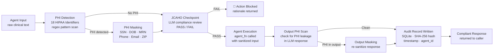

# Healthcare Compliance Guardrail

> **LangChain + Middleware** — The compliance layer every healthcare AI system needs

[]()
[]()
[]()
[]()

## The Problem

Most healthcare AI systems are built without compliance baked in — it's bolted on as an afterthought. This creates real risk: PHI exposure, regulatory violations, and hallucinated clinical guidance. This guardrail layer intercepts agent outputs before they reach users and enforces compliance rules at runtime.

## What It Does

A middleware guardrail system built with LangChain that:
- Intercepts LLM outputs before delivery to the end user
- Scans for potential PHI patterns and flags violations
- Blocks clinically unsafe or out-of-scope recommendations
- Logs compliance events for audit trail purposes
- Returns sanitized, compliant responses



## Tech Stack

| Layer | Technology |
|---|---|
| Agent Framework | LangChain |
| Guardrail Layer | Custom Python middleware |
| LLM | OpenAI GPT-4 |
| Language | Python 3.11+ |

## Getting Started

```bash
git clone https://github.com/jsfaulkner86/healthcare-compliance-guardrail
cd healthcare-compliance-guardrail
python -m venv venv
source venv/bin/activate  # Windows: venv\Scripts\activate
pip install -r requirements.txt
cp .env.example .env
python main.py
```

## Environment Variables

```
OPENAI_API_KEY=your_key_here
```

## Background

Built by [John Faulkner](https://linkedin.com/in/johnathonfaulkner), Agentic AI Architect and founder of [The Faulkner Group](https://thefaulknergroupadvisors.com). Designed from real HIPAA compliance requirements encountered across enterprise Epic EHR deployments.

## What's Next
- HITRUST control mapping integration
- Real-time PHI detection using NER models
- Pluggable rule engine for custom compliance policies

---
*Part of a portfolio of healthcare agentic AI systems. See all projects at [github.com/jsfaulkner86](https://github.com/jsfaulkner86)*
