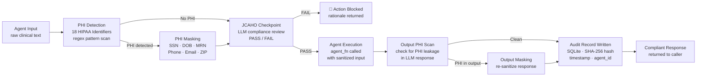

# Healthcare Compliance Guardrail

> **LangChain + Middleware** — The compliance layer every healthcare AI system needs

[]()
[]()
[]()
[]()

## The Problem

Most healthcare AI systems are built without compliance baked in — it's bolted on as an afterthought. This creates real risk: PHI exposure, regulatory violations, and hallucinated clinical guidance. This guardrail layer intercepts agent outputs before they reach users and enforces compliance rules at runtime.

## What It Does

A middleware guardrail system built with LangChain that:
- Intercepts LLM outputs before delivery to the end user
- Scans for potential PHI patterns and flags violations
- Blocks clinically unsafe or out-of-scope recommendations
- Logs compliance events for audit trail purposes
- Returns sanitized, compliant responses



## Tech Stack

| Layer | Technology |
|---|---|
| Agent Framework | LangChain |
| Guardrail Layer | Custom Python middleware |
| LLM | OpenAI GPT-4 |
| Language | Python 3.11+ |

## HIPAA Threat Model

This guardrail defends against the three primary HIPAA violation vectors in LLM-based healthcare AI:

| Threat Vector | Risk | Guardrail Defense |
|---|---|---|
| PHI echo in LLM output | Model regurgitates patient identifiers from context | Output PHI scan + masking before response delivery |
| PHI in agent input | Clinical notes sent raw to LLM API | Input PHI detection + masking before LLM call |
| Audit trail gap | No record of what the agent processed or decided | SHA-256 hashed input + structured SQLite audit log per 45 CFR §164.312(b) |
| Hallucinated clinical guidance | LLM invents diagnoses, dosages, or recommendations | JCAHO checkpoint — LLM-as-judge compliance review before execution |
| Unscoped agent action | Agent takes clinical action beyond its authorized scope | Action classification + JCAHO PASS/FAIL gate |

---

## PHI Identifier Coverage

Covers 8 of the [18 HIPAA Safe Harbor identifiers](https://www.hhs.gov/hipaa/for-professionals/privacy/special-topics/de-identification/index.html) via regex pattern matching:

| Identifier | Pattern Type | Status |
|---|---|---|
| Social Security Number | `\d{3}-\d{2}-\d{4}` | ✅ Covered |
| Date of Birth | MM/DD/YYYY format | ✅ Covered |
| Phone Number | US formats + E.164 | ✅ Covered |
| Email Address | RFC 5322 pattern | ✅ Covered |
| Medical Record Number | `MRN: XXXXXXXX` | ✅ Covered |
| ZIP Code | 5-digit + ZIP+4 | ✅ Covered |
| IP Address | IPv4 | ✅ Covered |
| Device Identifier | MAC address format | ✅ Covered |
| Full Name | NER model required | 🔜 Roadmap |
| Geographic data (sub-ZIP) | NER model required | 🔜 Roadmap |
| Dates (other than DOB) | Contextual parsing | 🔜 Roadmap |
| Account / Certificate numbers | Domain-specific patterns | 🔜 Roadmap |

> Full 18-identifier coverage requires NER-based detection (e.g., AWS Comprehend Medical, spaCy with `en_core_med7`). Roadmap item.

---

## Compliance Framework Alignment

| Control | Framework | Implementation |
|---|---|---|
| Audit controls | HIPAA 45 CFR §164.312(b) | SHA-256 hashed input log, timestamped per event |
| Access control | HIPAA 45 CFR §164.312(a) | `agent_id` scoped per guardrail instance |
| Transmission security | HIPAA 45 CFR §164.312(e) | PHI masked before any LLM API call (data never leaves unmasked) |
| Information integrity | JCAHO NPSG.01.01.01 | JCAHO checkpoint gate before agent execution |
| Minimum necessary | HIPAA Privacy Rule | PHI masked to minimum required for agent task |
| Incident response | HITRUST CSF 11.a | Audit log captures all PHI detection and masking events |

---

## Audit Record Schema

Every agent execution writes an immutable audit record:

```python
class AuditRecord(BaseModel):
    timestamp: str        # UTC ISO 8601
    agent_id: str         # Scoped agent identifier
    action: str           # What the agent was asked to do
    input_hash: str       # SHA-256 of raw input — never stores PHI
    phi_detected: list    # Which HIPAA identifiers were found
    phi_masked: bool      # Whether masking was applied
    jcaho_check_passed: bool  # JCAHO compliance gate result
    output_safe: bool     # Whether output was PHI-free
    notes: str            # JCAHO rationale
```

> The audit log stores the **hash** of input, never the raw content — satisfying the audit trail requirement under 45 CFR §164.312(b) without creating a secondary PHI repository.

## Getting Started

```bash
git clone https://github.com/jsfaulkner86/healthcare-compliance-guardrail
cd healthcare-compliance-guardrail
python -m venv venv
source venv/bin/activate  # Windows: venv\Scripts\activate
pip install -r requirements.txt
cp .env.example .env
python main.py
```

## Environment Variables

```
OPENAI_API_KEY=your_key_here
```

## Background

Built by [John Faulkner](https://linkedin.com/in/johnathonfaulkner), Agentic AI Architect and founder of [The Faulkner Group](https://thefaulknergroupadvisors.com). Designed from real HIPAA compliance requirements encountered across enterprise Epic EHR deployments.

## What's Next
- HITRUST control mapping integration
- Real-time PHI detection using NER models
- Pluggable rule engine for custom compliance policies

---
*Part of a portfolio of healthcare agentic AI systems. See all projects at [github.com/jsfaulkner86](https://github.com/jsfaulkner86)*
